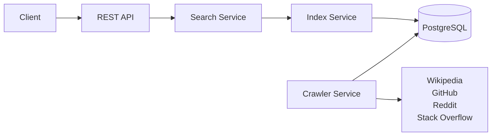
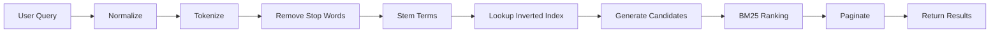
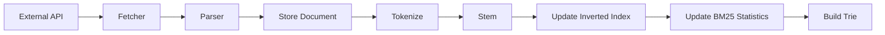

# Architecture

## Overview

TechAtlas is a **backend-first engineering knowledge search engine** that aggregates technical content from multiple trusted sources and provides a unified search interface.

The project is designed to demonstrate the core principles of modern search engines, including document ingestion, indexing, ranking, and retrieval.

The architecture follows a **Modular Monolith** pattern. Each subsystem has a well-defined responsibility while remaining part of a single deployable application.

---

# High-Level Architecture



---

# Core Components

## REST API

Exposes search and indexing endpoints.

Responsibilities:

* Receive HTTP requests
* Validate input
* Delegate to services
* Return JSON responses

---

## Search Service

Coordinates the search process.

Responsibilities:

* Execute search requests
* Retrieve candidate documents
* Invoke ranking engine
* Apply pagination
* Return ranked results

---

## Index Service

Responsible for maintaining the search index.

Responsibilities:

* Build inverted index
* Update index after new documents
* Maintain BM25 statistics
* Support incremental indexing

---

## Crawler Service

Fetches documents from external content providers.

Responsibilities:

* Call external APIs
* Download documents
* Trigger parsing
* Store raw document data

---

## Parser

Converts external data into the internal `Document` model.

Each provider can have its own parser while producing a common document structure.

---

## Ranking Engine

Ranks candidate documents using the **BM25** algorithm.

Future ranking signals may include:

* Popularity
* Freshness
* Source quality
* User behavior

---

## Autocomplete Service

Provides search suggestions using a Trie data structure.

The Trie is rebuilt whenever the search index is updated.

---

# Search Pipeline



---

# Indexing Pipeline



---

# Package Structure

```text
src/main/java/
│
├── controller/
├── service/
├── fetcher/
├── parser/
├── index/
├── ranking/
├── autocomplete/
├── repository/
├── entity/
├── dto/
├── config/
├── util/
└── exception/
```

---

# Data Flow

The application consists of three primary workflows:

### 1. Document Ingestion

External Source

↓

Fetcher

↓

Parser

↓

Database

---

### 2. Index Construction

Database

↓

Tokenizer

↓

Stemmer

↓

Inverted Index

↓

BM25 Statistics

↓

Trie

---

### 3. Search

User Query

↓

Search Service

↓

Index Lookup

↓

Ranking

↓

Results

---

# Design Principles

The project follows these architectural principles:

* Modular Monolith architecture
* Separation of concerns
* API-first integrations
* Extensible source connectors
* Clean package organization
* Database as the source of truth
* Stateless REST services where possible

---

# Scalability

The architecture is designed to support additional content providers without changes to the search engine core.

Adding a new provider requires:

1. Implement a Fetcher.
2. Implement a Parser.
3. Register the provider.
4. Re-index the documents.

No modifications to the search or ranking pipeline are required.

---

# Future Improvements

Potential future enhancements include:

* Redis caching
* Distributed indexing
* Elasticsearch integration
* Semantic/vector search
* Synonym expansion
* Query suggestions
* Learning-to-rank
* Personalized search
* Real-time indexing

---

# Architecture Summary

* **Architecture Style:** Modular Monolith
* **Language:** Java 21
* **Framework:** Spring Boot
* **Database:** PostgreSQL
* **Ranking Algorithm:** BM25
* **Index Structure:** Inverted Index
* **Autocomplete:** Trie
* **Documentation:** OpenAPI / Swagger
* **Deployment:** Docker
