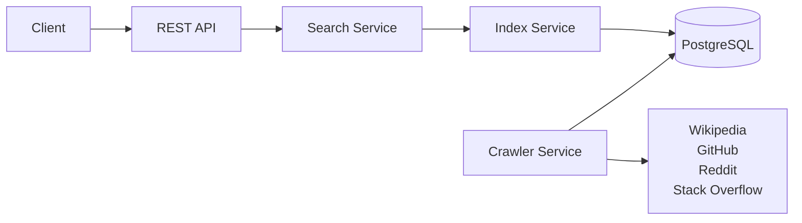
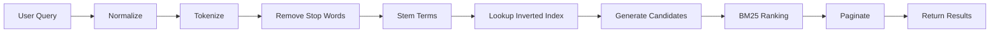
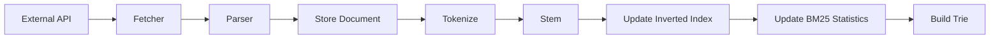

# Architecture

## Overview

TechAtlas is a **backend-first engineering knowledge search engine** that aggregates technical content from multiple trusted sources and provides a unified search interface.

The project is designed to demonstrate the core principles of modern search engines, including document ingestion, indexing, ranking, and retrieval.

The architecture follows a **Modular Monolith** pattern. Each subsystem has a well-defined responsibility while remaining part of a single deployable application.

---

# High-Level Architecture


```mermaid
flowchart LR

User["Client"]

API["REST API"]

Search["Search Service"]

Index["Index Service"]

DB[(PostgreSQL)]

Crawler["Crawler Service"]

External["Wikipedia<br/>GitHub<br/>Reddit<br/>Stack Overflow"]

User --> API
API --> Search
Search --> Index
Index --> DB

Crawler --> External
Crawler --> DB
```

---

# Core Components

## REST API

Exposes search and indexing endpoints.

Responsibilities:

* Receive HTTP requests
* Validate input
* Delegate to services
* Return JSON responses

---

## Search Service

Coordinates the search process.

Responsibilities:

* Execute search requests
* Retrieve candidate documents
* Invoke ranking engine
* Apply pagination
* Return ranked results

---

## Index Service

Responsible for maintaining the search index.

Responsibilities:

* Build inverted index
* Update index after new documents
* Maintain BM25 statistics
* Support incremental indexing

---

## Crawler Service

Fetches documents from external content providers.

Responsibilities:

* Call external APIs
* Download documents
* Trigger parsing
* Store raw document data

---

## Parser

Converts external data into the internal `Document` model.

Each provider can have its own parser while producing a common document structure.

---

## Ranking Engine

Ranks candidate documents using the **BM25** algorithm.

Future ranking signals may include:

* Popularity
* Freshness
* Source quality
* User behavior

---

## Autocomplete Service

Provides search suggestions using a Trie data structure.

The Trie is rebuilt whenever the search index is updated.

---

# Search Pipeline


```mermaid
flowchart LR

A[User Query]
--> B[Normalize]
--> C[Tokenize]
--> D[Remove Stop Words]
--> E[Stem Terms]
--> F[Lookup Inverted Index]
--> G[Generate Candidates]
--> H[BM25 Ranking]
--> I[Paginate]
--> J[Return Results]
```

---

# Indexing Pipeline


```mermaid
flowchart LR

A[External API]
--> B[Fetcher]
--> C[Parser]
--> D[Store Document]
--> E[Tokenize]
--> F[Stem]
--> G[Update Inverted Index]
--> H[Update BM25 Statistics]
--> I[Build Trie]
```

---

# Inverted Index & Text Processing Pipeline

Phase 4 implements a linear text processing pipeline to ingest documents and record term statistics into a fast, in-memory search index.

### 1. Ingestion Pipeline Sequence
For any ingested document:
1. **Extraction**: The raw text content is extracted. If empty, the document is skipped safely, marked `ACTIVE` with `indexedAt` timestamp, but no postings are recorded.
2. **Tokenization** ([Tokenizer](file:///c:/Users/Soham/Desktop/Gen-AI/TechAtlas/TechAtlas/src/main/java/com/techatlas/tokenizer/Tokenizer.java)): Splits the text on whitespace, strips general Unicode punctuation/symbols, and outputs alphanumeric tokens.
3. **Normalization** ([TextNormalizer](file:///c:/Users/Soham/Desktop/Gen-AI/TechAtlas/TechAtlas/src/main/java/com/techatlas/normalizer/TextNormalizer.java)): If enabled (via configuration), converts tokens to lowercase, trims whitespace, removes remaining punctuation, and collapses multiple spaces while retaining numeric values.
4. **Stop Word Filter** ([StopWordFilter](file:///c:/Users/Soham/Desktop/Gen-AI/TechAtlas/TechAtlas/src/main/java/com/techatlas/stopwords/StopWordFilter.java)): Compares normalized tokens against the externalized configurable list. Matches are ignored.
5. **Stemming** ([PorterStemmerAdapter](file:///c:/Users/Soham/Desktop/Gen-AI/TechAtlas/TechAtlas/src/main/java/com/techatlas/stemmer/PorterStemmerAdapter.java)): Uses Martin Porter's algorithm to strip suffixes from English words to retrieve their core root forms.
6. **Frequency Counter**: Counts occurrences of each root term within the document scope.
7. **Insertion**: Inserts postings into the in-memory inverted index map.

### 2. Data Structures
* **Posting** ([Posting](file:///c:/Users/Soham/Desktop/Gen-AI/TechAtlas/TechAtlas/src/main/java/com/techatlas/model/Posting.java)): Immutable Java record tracking `documentId` (UUID) and `termFrequency` (int).
* **PostingList** ([PostingList](file:///c:/Users/Soham/Desktop/Gen-AI/TechAtlas/TechAtlas/src/main/java/com/techatlas/model/PostingList.java)): Wraps a `CopyOnWriteArrayList<Posting>` to hold matching documents for a specific term. Includes clean logic to remove a document's postings to safely support re-indexing.
* **InvertedIndex** ([InvertedIndex](file:///c:/Users/Soham/Desktop/Gen-AI/TechAtlas/TechAtlas/src/main/java/com/techatlas/model/InvertedIndex.java)): A thread-safe component wrapping `ConcurrentHashMap<String, PostingList>`. Keeps track of:
  * Vocabulary Size (unique terms count).
  * Document Count (unique indexed documents).
  * Total Postings (sum of sizes of all posting lists).

---

# Incremental Indexing Pipeline

Phase 6 implements a document-level incremental indexing mechanism to maintain the in-memory inverted index without requiring full rebuilds on every change.

### 1. Document Lifecycle & Transitions
```text
Document Created/Modified
        ↓
  PENDING_INDEX
        ↓
  indexDocument(UUID)
        ↓
  Evict Old Postings
        ↓
  Process & Parse Content (Tokenize, Normalize, Stem)
        ↓
  Insert New Postings & Document Length
        ↓
     ACTIVE (indexedAt set to current timestamp)
```

- **Eviction of Stale Data**: When a document is modified or re-indexed, the indexing service first calls `invertedIndex.removeDocument(id)`. This clears the document's postings from all term lists, deletes its document-length statistics, and removes any posting lists that become empty (avoiding stale vocabulary terms).
- **Deletion Synchronization**: When a document is deleted via `DELETE /api/v1/documents/{id}`, `DocumentServiceImpl` removes it from PostgreSQL and calls `invertedIndex.removeDocument(id)` to immediately evict its indexing postings from the runtime search structure, avoiding search query orphans.
- **In-Memory Volatility**: The inverted index is runtime-only and maintained in memory. Upon application restart, the index is empty and must be populated using the full rebuild endpoint (`POST /api/v1/index/rebuild`), which loads non-deleted documents from the database and indexes them sequentially.

---

# Category-based Ingestion & Discovery Pipeline

Phase 7 implements controlled recursive category-based Wikipedia discovery to expand the TechAtlas document corpus automatically.

### 1. Discovery & Ingestion Sequence
```text
  GET/POST Trigger (API)
            ↓
    BFS Category Queue
            ↓
  For each Category Page:
    - Get Members (Articles & Subcategories)
    - If Article (ns=0) & not Visited:
       Fetch summary → import → Save Document (PENDING_INDEX) → Save article sync record
    - If Subcategory (ns=14) & depth < maxDepth:
       Queue subcategory with depth + 1
            ↓
  Save category sync record (last_synced_at)
```

- **Controlled Traversal Boundaries**: The discovery is strictly bound by `maxArticles` (maximum articles imported in a single run) and `maxDepth` (depth level limit for BFS subcategory queuing). Unrestricted recursive crawls are prevented.
- **Visited Category & Article Tracking**: Visited categories and articles are persisted in PostgreSQL (`wikipedia_sync_categories` and `wikipedia_sync_articles` tables). Visited articles are skipped on subsequent discovery runs to ensure operation idempotency and avoid duplicate imports/API calls.
- **Graceful Failure Handling**: Single-article import failures (e.g., malformed content or network issues) are logged and caught, allowing the rest of the bulk discovery to continue.

---

# GitHub Ingestion & Discovery Pipeline

Phase 8 implements controlled repository-level GitHub discovery and ingestion to expand the engineering knowledge corpus with repository READMEs.

### 1. Ingestion & Mapping Architecture
```text
  Wikipedia API ─────────┐
                         │
  GitHub REST API ───────┼─► Common Document (PENDING_INDEX) ─► DB (PostgreSQL) ─► Indexing ─► Inverted Index
                         │
  Stack Overflow API ────┤
                         │
  Manual Upload ─────────┘
```

- **Pluggable Fetcher Pipeline**: The GitHub integration implements a source-specific pipeline (`GitHubClient`, `GitHubService`, `GitHubMapper`) that searches repositories and downloads README markdown content using the official GitHub REST API.
- **Stable Visited Repository Tracking**: To avoid duplicate crawling, visited repository metadata (specifically the unique GitHub repository ID and last sync timestamps) are persisted in PostgreSQL (`github_sync_repositories`).
- **Reuse of Lifecycle & Incremental Indexing**: Once repository contents are mapped into the shared `Document` model (with `source = GITHUB` and `category = query`), they enter the standard lifecycle. Any content changes during discovery automatically evict old index postings, update the document status to `PENDING_INDEX`, and request re-indexing via the agnostic `IndexService`.

---

# Stack Overflow Ingestion & Discovery Pipeline

Phase 9 implements controlled Stack Overflow question and answer discovery to build a technical Q&A search corpus.

- **One-Question-One-Document Strategy**: Each imported Stack Overflow question is stored as exactly one `Document` record in TechAtlas. The content field compiles the question body, its accepted answer (if available), and other high-scoring answers up to configurable limits.
- **HTML Content Stripping**: HTML bodies returned by the API are passed through `HtmlToTextParser.java`, which converts code tags into Markdown blocks while stripping all other tags to build clean, indexable text content.
- **Deduplication & Updates**: Discovered questions are logged in `stackoverflow_sync_questions` by their unique API question ID. If a question is re-encountered with updated body text, the service automatically modifies the existing document, sets its status to `PENDING_INDEX`, evicts its postings from the memory index, and triggers re-indexing.

---

# Source Synchronization Engine

Phase 10 introduces the Source Synchronization Engine to track external resources systematically and decide whether they have changed since TechAtlas last synchronized them.

### 1. Ingestion Responsibilities

The ingestion pipelines are divided into three distinct steps:
1. **Discovery**: "Which external resources should we know about?" (e.g. Wikipedia category traversal, GitHub repository search, Stack Overflow search query).
2. **Synchronization**: "Has this known external resource changed since TechAtlas last synchronized it?" (e.g. comparing Wikipedia page revision ID, GitHub README blob SHA, Stack Overflow question activity timestamp, or falling back to a SHA-256 content hash check).
3. **Indexing**: "Has the TechAtlas document changed, and therefore does the inverted index need updating?" (e.g. incremental document-level index eviction and indexing).

### 2. Synchronization Sequence flow

```text
External Source
      │
      ▼
  Discovery
      │
      ▼
Known External Resource
      │
      ▼
Source Synchronizer
      │
      ▼
Revision / Hash Comparison
      │
   ┌──┴────────────┐
   │   Changed?    │
   └──┬─────────┬──┘
   NO │     YES │
      │         │
      ▼         ▼
    Skip /    Update Document
    Check       │
                ▼
          PENDING_INDEX
                │
                ▼
          Incremental Indexing
                │
                ▼
              ACTIVE
```

### 3. Background Scheduling
Phase 11 layers an automated background synchronization mechanism ([SyncScheduler](file:///c:/Users/Soham/Desktop/Gen-AI/TechAtlas/TechAtlas/src/main/java/com/techatlas/scheduler/SyncScheduler.java)) over the synchronization interface:
- **Delay Strategy**: Configures a fixed delay (`fixed-delay-ms`) rather than fixed rate to ensure slow API calls do not cause overlapping cycles.
- **Overlap Prevention**: Enforces a thread-safe `Set<SourceType>` concurrency guard to block parallel synchronization calls for the same source from both background jobs and manual REST invocations.
- **Failure Isolation**: Wraps executions for each source in separate try-catch blocks to prevent any source API failures from stopping the rest of the synchronization cycle.

---

# Caching Infrastructure & Performance

Phase 12 introduces a Redis performance caching layer to significantly accelerate queries and metadata retrievals. 

### 1. Source of Truth Hierarchy
1. **PostgreSQL**: Authoritative persistent document state.
2. **InvertedIndex**: Authoritative in-memory searchable index mapping terms to postings.
3. **Redis**: Temporary performance cache (evictable, optional fallback).

### 2. Cache Keys Strategy
- **Document Detail Key**: `document:{id}`. Caches individual `DocumentResponse` payloads.
- **Search Result Key**: `search:{hash-of-canonical-request}`. The query, page, and size parameters are normalized and hashed via SHA-256 to produce a compact, deterministic string.

### 3. Invalidation Strategy
- **Document Modifications**: Any create, update, delete, or synchronization writes immediately evict the corresponding `document:{id}` key and clear all `search:*` keys globally.
- **Index Changes**: Index rebuilds, removals, or incremental indexing tasks clear all `search:*` keys globally.
- **Unchanged Sync**: If source synchronization detects no external modifications, caches remain completely untouched.

### 4. Fault-Tolerance
The caching layer wraps all operations in generic try-catch blocks. If Redis goes offline or connection timeouts occur:
- Operations fail silently.
- Search fallbacks to the standard InvertedIndex + PostgreSQL path.
- Individual document queries fall back to direct PostgreSQL reads.
- Log failures cleanly without raising HTTP 500 or interrupting ingestion.

---

# Search Engine & BM25 Ranking Pipeline

Phase 5 introduces the query processing, document scoring, and search retrieval endpoints.

### 1. Search Query Pipeline Sequence
For any user query submitted to `GET /api/v1/search`:
1. **Validation**: The service rejects null, empty, or whitespace-only queries with `400 Bad Request`.
2. **Query Processing** ([QueryProcessor](file:///c:/Users/Soham/Desktop/Gen-AI/TechAtlas/TechAtlas/src/main/java/com/techatlas/search/QueryProcessor.java)): Reuses tokenizer, normalizer, stop words, and stemmer to transform query text into a list of unique stemmed search terms. If no terms remain, an empty result is returned immediately.
3. **Candidate Document Scoring** ([RankingEngine](file:///c:/Users/Soham/Desktop/Gen-AI/TechAtlas/TechAtlas/src/main/java/com/techatlas/search/RankingEngine.java)):
   - Looks up the posting lists for each processed term.
   - Calculates the Inverse Document Frequency (IDF) using standard BM25 formulation:
     $$\text{IDF}(q_i) = \ln\left(1 + \frac{N - n(q_i) + 0.5}{n(q_i) + 0.5}\right)$$
   - Computes term scores and accumulates them across matching documents using doc lengths and average doc length in-memory stats.
4. **Ranking & Pagination** ([SearchServiceImpl](file:///c:/Users/Soham/Desktop/Gen-AI/TechAtlas/TechAtlas/src/main/java/com/techatlas/service/SearchServiceImpl.java)): Sorts candidates by score descending, slices results based on `page` and `size`, fetches matching records from database, extracts window snippets around match locations, and returns paginated response metadata.

---

# Package Structure

```text
src/main/java/
│
├── controller/
├── service/
├── fetcher/
├── parser/
├── index/
├── ranking/
├── autocomplete/
├── repository/
├── entity/
├── dto/
├── config/
├── util/
└── exception/
```

---

# Data Flow

The application consists of three primary workflows:

### 1. Document Ingestion

External Source

↓

Fetcher

↓

Parser

↓

Database

---

### 2. Index Construction

Database

↓

Tokenizer

↓

Stemmer

↓

Inverted Index

↓

BM25 Statistics

↓

Trie

---

### 3. Search

User Query

↓

Search Service

↓

Index Lookup

↓

Ranking

↓

Results

---

# Design Principles

The project follows these architectural principles:

* Modular Monolith architecture
* Separation of concerns
* API-first integrations
* Extensible source connectors
* Clean package organization
* Database as the source of truth
* Stateless REST services where possible

---

# Scalability

The architecture is designed to support additional content providers without changes to the search engine core.

Adding a new provider requires:

1. Implement a Fetcher.
2. Implement a Parser.
3. Register the provider.
4. Re-index the documents.

No modifications to the search or ranking pipeline are required.

---

# Future Improvements

Potential future enhancements include:

* Redis caching
* Distributed indexing
* Elasticsearch integration
* Semantic/vector search
* Synonym expansion
* Query suggestions
* Learning-to-rank
* Personalized search
* Real-time indexing

---

# Autocomplete & Search Suggestions

Phase 13 introduces prefix-based term and popular query suggestions to enhance user interaction.

### 1. In-Memory Prefix Trie Structure
Vocabulary dictionary terms are hosted in a thread-safe `PrefixTrie` (`ConcurrentHashMap` children maps, `volatile String` terminal fields).
- **Time Complexity**:
  - Insertion: $O(L)$, where $L$ is the length of the inserted term.
  - Prefix Lookup: $O(P + M)$, where $P$ is the length of the prefix and $M$ is the number of node paths explored under the subtree.
- **Space Complexity**: Bounded directly by the active vocabulary size in the `InvertedIndex`. No duplicate term strings are stored.

### 2. Inverted Index Synchronization
The `PrefixTrie` lifecycle is tightly hooked to the `InvertedIndex` mutations:
- **Index/Re-index**: Terms are incrementally inserted via `PrefixTrie.insert(term)` during document indexing.
- **Eviction/Deletion**: When a document is removed or updated, any terms whose total document frequency falls to zero are incrementally purged via `PrefixTrie.remove(term)`.
- **Rebuild/Clear**: Complete index rebuilds invoke `PrefixTrie.clear()` before parsing, guaranteeing zero stale terms.

### 3. Query Popularity & Recent Tracker
Every successful search request is processed by `QueryTracker`:
- **Redis Mode**: Increments sorted set metrics (`autocomplete:popular`) and left-pushes recent queries (`autocomplete:recent`) keeping it trimmed via `LTRIM`.
- **In-Memory Fallback Mode**: If Redis is offline or disabled, it transparently records metrics in a local `ConcurrentHashMap` and a bounded `LinkedList` to prevent application crashes.

### 4. Ranking Formula
Returned autocomplete matches are sorted deterministically based on:
1. **Corpus Frequency**: Cumulative term frequency resolved directly from `InvertedIndex.retrieve(term)` for `TERM` type, or popularity count from `QueryTracker` for `QUERY` type.
2. **Lexical Ordering**: Alphabetical tie-breaker.
3. **Type Tie-Breaker**: Sort `QUERY` suggestions before `TERM` suggestions.

---

# Analytics & Monitoring

Phase 14 introduces a lightweight, production-oriented analytics and monitoring subsystem to provide visibility into search usage, document statistics, indexing operational counters, and sync scheduler health.

### 1. Database Persistent Metrics
- **Schema**: Performed via Flyway (`search_analytics`), capturing query string, normalized query string, timestamp, page size, result counts, latencies, cache status, and page offset.
- **Projections**: Custom JPA projections (`QueryCountProjection`, `ZeroResultProjection`, `LatencyStatsProjection`, `SyncHealthProjection`, `SourceCountProjection`, `StatusCountProjection`, `CategoryCountProjection`) allow high-performance grouped query metrics calculations on H2/PostgreSQL.

### 2. Runtime Dynamic Metrics
- **Index Counters**: Thread-safe `AtomicLong` counters monitor index attempts, index successes, failures, and aggregate nano timing latencies.
- **Sync Durations**: Tracks synchronization runs for Wikipedia, GitHub, and Stack Overflow, keeping duration metrics, status codes, and checked resource counts in memory.
- **Redis Stats**: Hits, misses, and availability status details are compiled from the `CacheService`.

### 3. Failure Isolation & Graceful Fallback
- Analytics metrics logs are decoupled from search, indexing, and synchronization pipelines.
- Exception handlers surround all analytics repository/Redis writes to log error warnings and proceed cleanly without interrupting the primary application flows or returning HTTP 500 errors to clients.

---

# Architecture Summary

* **Architecture Style:** Modular Monolith
* **Language:** Java 24
* **Framework:** Spring Boot
* **Database:** PostgreSQL
* **Ranking Algorithm:** BM25
* **Index Structure:** Inverted Index
* **Autocomplete:** Trie
* **Analytics Layer:** Search Analytics Table & Projections
* **Documentation:** OpenAPI / Swagger
* **Deployment:** Docker
