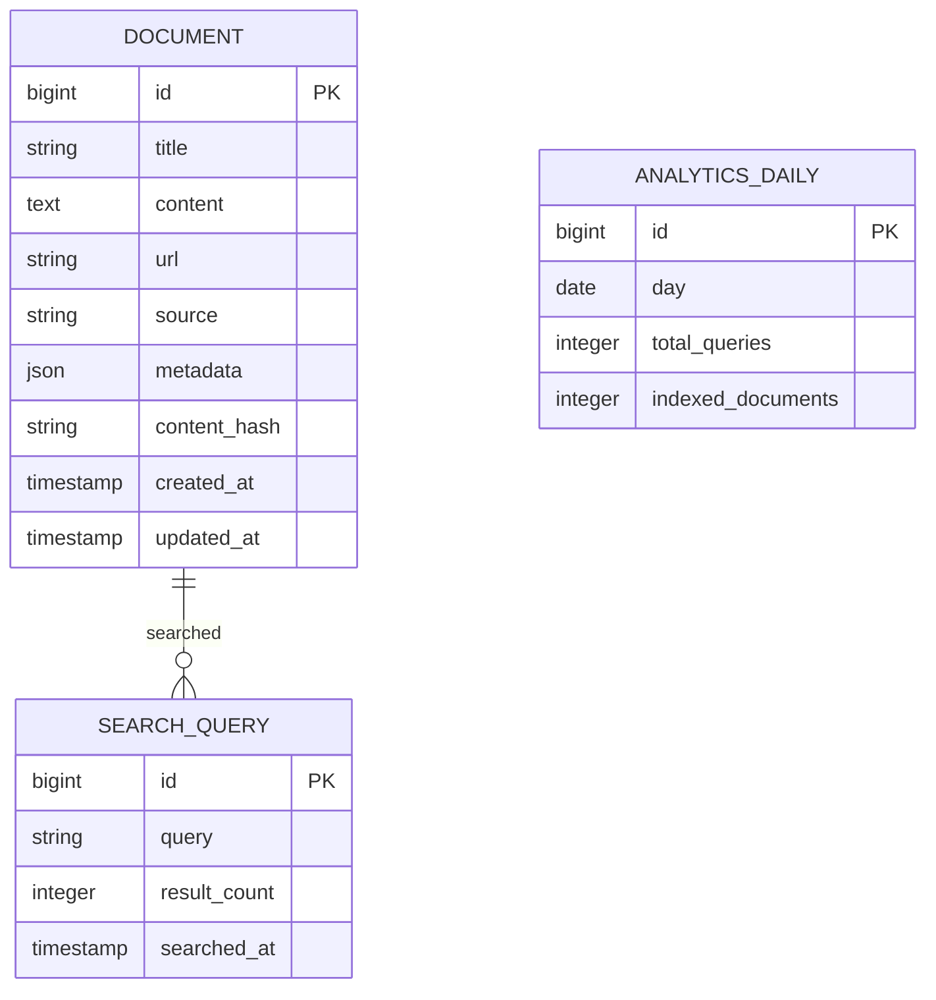

# Database Design

## Overview

TechAtlas uses **PostgreSQL** as its primary data store and source of truth.

The database stores raw documents, metadata, search statistics, and indexing information. The search index is derived from this data and can be rebuilt whenever required.

Database migrations are managed using **Flyway**.

---

# Design Principles

* PostgreSQL is the single source of truth.
* Search indexes are derived from stored documents.
* Database schema should support incremental indexing.
* Source-specific metadata is stored without affecting the core schema.
* Tables are normalized where practical.

---

# Entity Relationship Diagram



---

# Tables

## Document

Stores every indexed document regardless of source.

| Column       | Type      | Description                 |
| ------------ | --------- | --------------------------- |
| id           | BIGINT    | Primary key                 |
| title        | VARCHAR   | Document title              |
| content      | TEXT      | Parsed document content     |
| url          | VARCHAR   | Original document URL       |
| source       | VARCHAR   | Content provider            |
| metadata     | JSONB     | Source-specific information |
| content_hash | VARCHAR   | Duplicate detection         |
| created_at   | TIMESTAMP | Record creation time        |
| updated_at   | TIMESTAMP | Last update time            |

---

## Search Query

Stores search activity for analytics.

| Column       | Type      | Description                |
| ------------ | --------- | -------------------------- |
| id           | BIGINT    | Primary key                |
| query        | VARCHAR   | User search query          |
| result_count | INTEGER   | Number of returned results |
| searched_at  | TIMESTAMP | Search timestamp           |

---

## Analytics Daily

Stores aggregated daily statistics.

| Column            | Type    | Description                 |
| ----------------- | ------- | --------------------------- |
| id                | BIGINT  | Primary key                 |
| day               | DATE    | Calendar day                |
| total_queries     | INTEGER | Total searches              |
| indexed_documents | INTEGER | Number of indexed documents |

---

# Search Index

The inverted index is a derived data structure built from the `Document` table.

The initial implementation may keep this index in memory while rebuilding it from stored documents during application startup.

A future version may persist posting lists in dedicated database tables if startup time or dataset size becomes a concern.

---

# Metadata

Different content providers expose different attributes.

Instead of creating provider-specific columns, TechAtlas stores these values in the `metadata` JSONB column.

Examples include:

### Wikipedia

* Last edited date
* Categories
* Language

### GitHub

* Repository stars
* Programming language
* Fork count

### Reddit

* Subreddit
* Upvotes
* Author

This keeps the schema stable while allowing new providers to be added easily.

---

# Indexing Strategy

To support incremental indexing, each document stores a `content_hash`.

During synchronization:

1. Fetch document.
2. Compute content hash.
3. Compare with stored hash.
4. Skip unchanged documents.
5. Re-index modified documents only.

This avoids rebuilding the entire search index unnecessarily.

---

# Database Indexes

Recommended database indexes:

| Table          | Column       | Purpose             |
| -------------- | ------------ | ------------------- |
| Document       | source       | Filter by provider  |
| Document       | url          | Fast lookups        |
| Document       | content_hash | Duplicate detection |
| SearchQuery    | searched_at  | Analytics           |
| AnalyticsDaily | day          | Reporting           |

---

# Migration Strategy

All schema changes are managed using **Flyway**.

Example migration structure:

```text
db/
└── migration/
    ├── V1__create_document_table.sql
    ├── V2__create_search_query_table.sql
    ├── V3__create_analytics_table.sql
```

Each migration should be immutable and version-controlled.

---

# Future Enhancements

Potential additions include:

* Dedicated `Source` table
* Persisted inverted index
* Posting list storage
* Term statistics table
* Scheduled indexing history
* Search click tracking
* User preferences
* Cached query results

---

# Summary

* **Database:** PostgreSQL
* **Migration Tool:** Flyway
* **Primary Entity:** Document
* **Metadata Storage:** JSONB
* **Duplicate Detection:** Content Hash
* **Analytics:** Search Query & Daily Metrics
* **Source of Truth:** PostgreSQL
